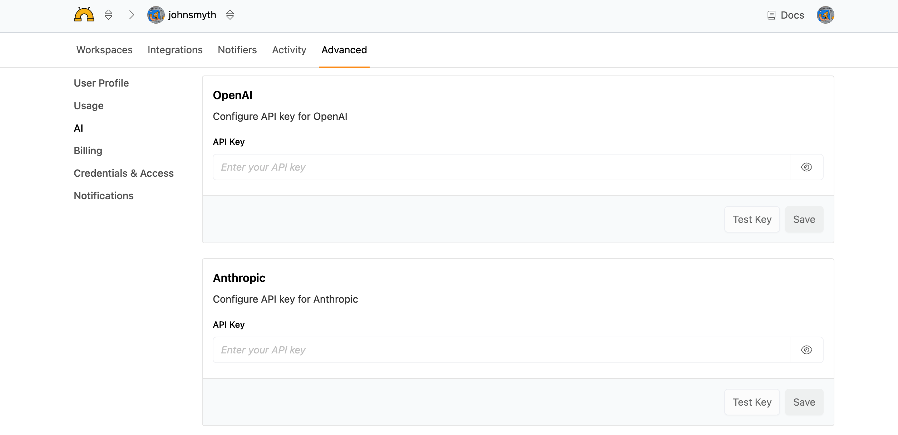

# AI Settings

Turbot Pipes includes an integrated AI chat assistant that helps you query, analyze, and understand your cloud infrastructure data. The AI chat feature provides intelligent assistance for running Steampipe queries, generating reports, and exploring your connected resources.

Pipes includes a small amount of monthly AI usage for each user. This free tier is limited to the GPT-5 Mini model.  You may instead configure Pipes to use your own OpenAI or Anthropic API key.  

To configure your AI API keys, go to the **Advanced** page for your developer account and click **AI** from the left-hand menu.  The AI settings page will not be available if your developer account is part of a [tenant](/pipes/docs/accounts/tenant).

Enter your OpenAI and/Anthropic key, click the **Test Key** button to verify that it's working, then click **Save** to begin using the key in your developer account.  

Once your key has been set, you will be able to [select from additional models](/pipes/docs/using/chat/conversation#selecting-a-model) when starting a conversation.  Note that once you have added an AI API key, only your key will be used; the free `GPT-5 Mini` key will no longer be available.