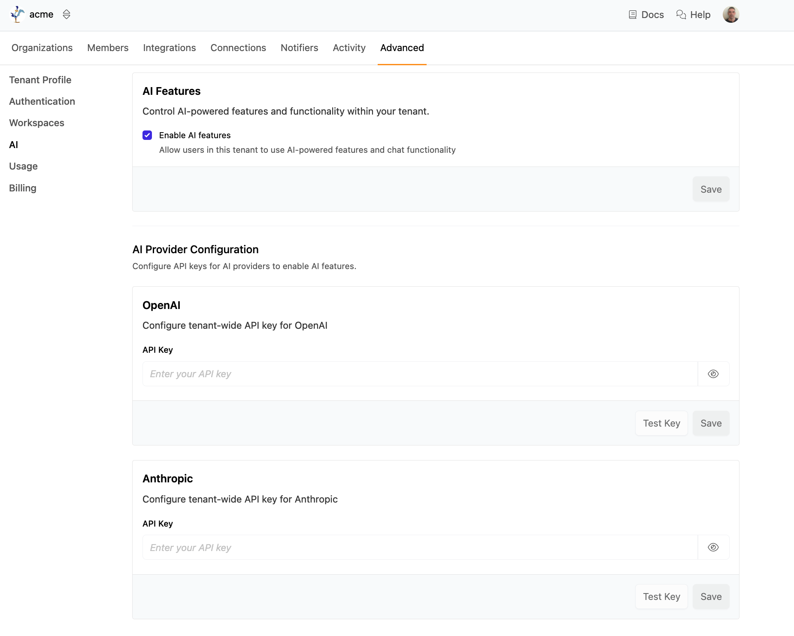

# AI Settings

Turbot Pipes includes an integrated AI chat assistant that helps you query, analyze, and understand your cloud infrastructure data. The AI chat feature provides intelligent assistance for running Steampipe queries, generating reports, and exploring your connected resources.

You can view and manage AI settings from the **Advanced** page for your tenant. Navigate to your tenant, then click the double arrow button from the navigation at the top of the page and select **Tenant Settings** from the dropdown. Go to the **Advanced** tab, and select **AI** from the left-hand menu.  The AI settings page will only be available if you are a Tenant Owner for the tenant.

By default, [AI features](/pipes/docs/using/chat) are enabled in your tenant.  If you wish to disable the AI features, deselect **Enable AI features** and click **Save**.

Pipes includes a small amount of monthly AI usage for each user. This free tier is limited to the GPT5-Mini model.  You may instead configure Pipes to use your own OpenAI or Anthropic API key.  

Enter your OpenAI and/or Anthropic key, click the **Test Key** button to verify that it's working, then click **Save** to begin using the key in your tenant.  

Once your key has been set, you will be able to [select from additional models](/pipes/docs/using/chat/conversation#selecting-a-model) when starting a conversation.  Note that once you have added an AI API key, only your key will be used; the free `GPT-5 Mini` key will no longer be available.
