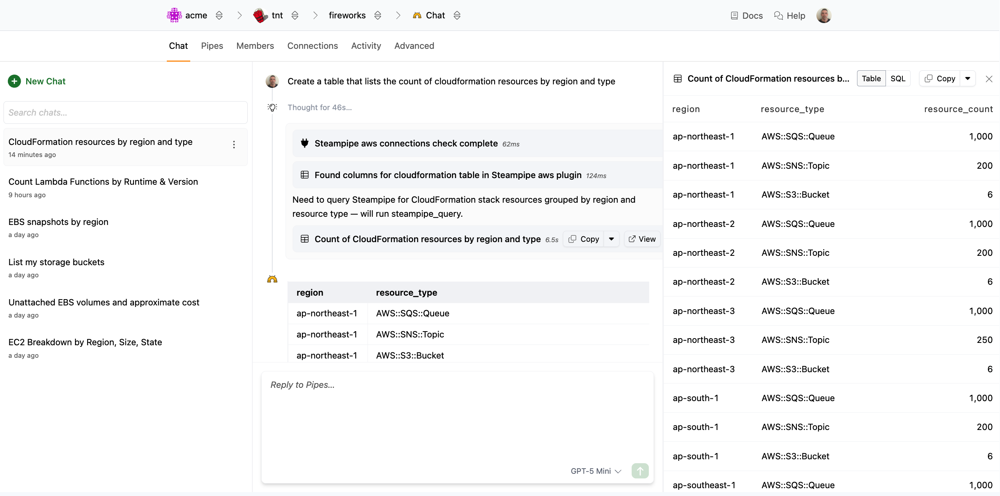
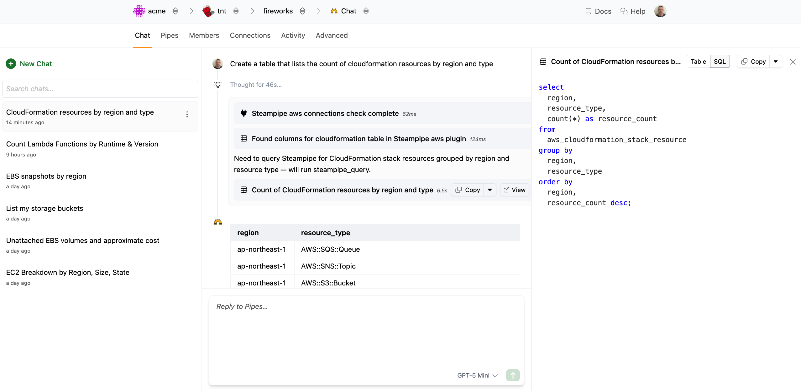
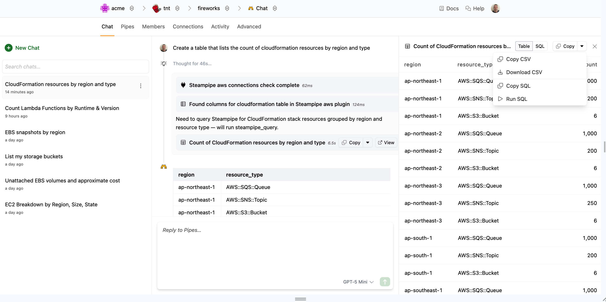

# Interacting with the Canvas

Some responses will include structured artifacts like tables, code, or markdown documents.  These artifacts may appear in the main response or the thinking.  Click the **View** button next to the artifact to view it in a canvas. The canvas will open on the right side of the screen.

The exact view will depend on the type of artifact, as will the buttons and actions available.  The grid view, for instance, allows you to view the SQL that was used to generate the results.

Click the **Copy** button to copy or download the results or the query.

<!--

-->

Hovering over a table header will provide a pop-up menu that allows you to copy, filter, download, or view details of the results.
<!--

-->

Hovering over a table call will provide a pop-up menu that allows you to copy, filter, exclude, or view details of the cell.

<!--vv

-->

