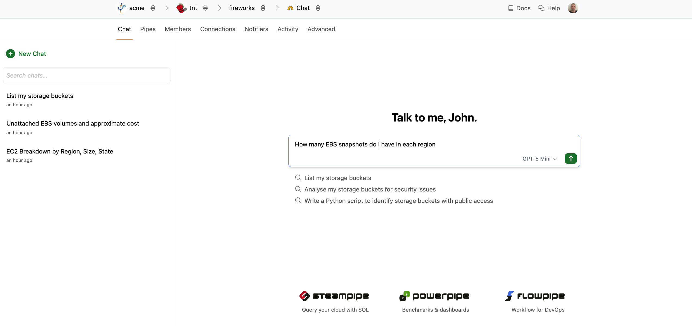
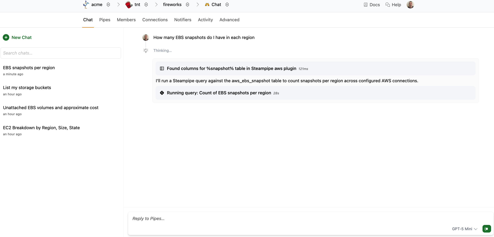
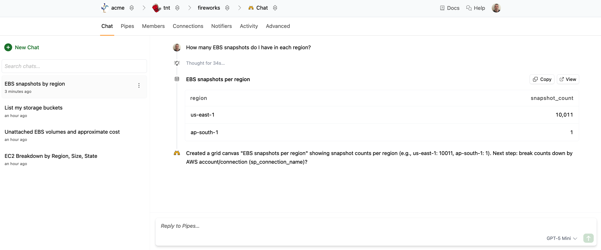
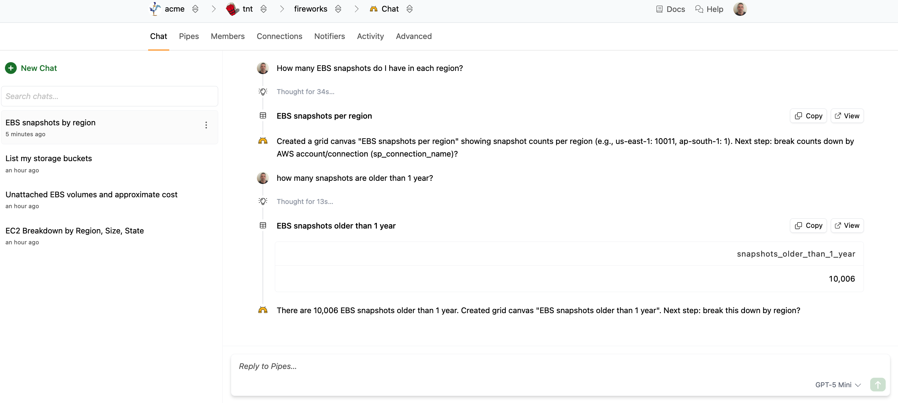
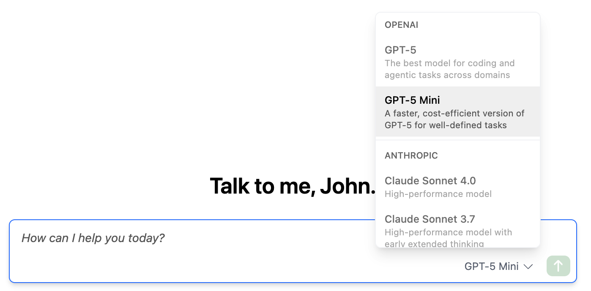
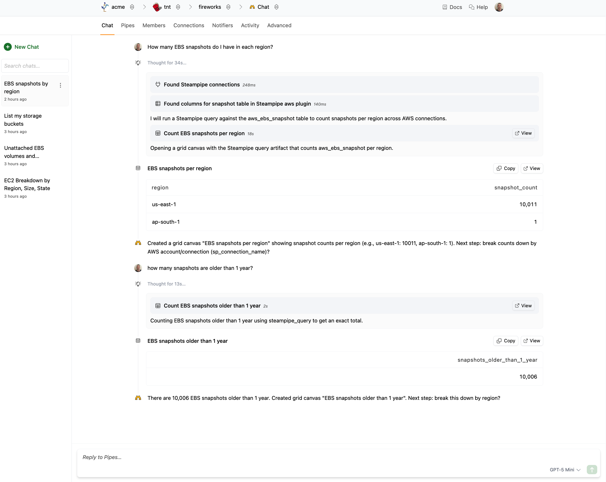

# Having a Conversation

To start a new conversation, type your prompt in the text box, [select a model](#selecting-a-model), and then click the green arrow button or hit the **Enter** key. 

The screen will update as the model is thinking and working on a response.  

When it's done thinking, the results are displayed.

If you want, you can continue asking questions. The context will be maintained for the duration of the conversation.

## Selecting a Model 

If you have configured an AI API key, you may use the model selector at the bottom right of the text box to choose which AI model to use for your conversation. Note that you cannot change the model once you have started the conversation.

Pipes includes a small amount of monthly AI usage for each user. This free tier is limited to the GPT-5 Mini model.  You may instead configure Pipes to use your own OpenAI or Anthropic API key.  Where to configure the key depends on your [plan](https://turbot.com/pipes/pricing):
  - Enterprise customers may [configure their keys on their tenant](/pipes/docs/accounts/tenant/ai).
  - Team plan customers may [configure their keys on their organization](/pipes/docs/accounts/org/ai).
  - Developer tier users may [configure their keys on their personal developer account](/pipes/docs/accounts/developer/ai).
  

## Viewing Detailed Thinking

Every time you send a new prompt in the conversation, the AI agent will perform thinking steps.  By default, the visibility of the thinking is minimized.  You can, however, view the full details of the thinking.  To view the thinking for a step, click the node in the chat stream to expand it; it will say **Thinking** while it is in progress, or **Thought for {duration}** once it is complete.

## Tips for Effective Use

- **Be specific** - Include details about what you want to analyze or accomplish
- **Ask follow-up questions** - The AI maintains conversation context for deeper exploration  
- **Request different formats** - Ask for reports, scripts, or specific analysis approaches
- **Combine topics** - Ask questions that span multiple AWS services or cloud providers

The AI chat feature makes it easy to explore and understand your cloud infrastructure without needing to write complex SQL queries manually.