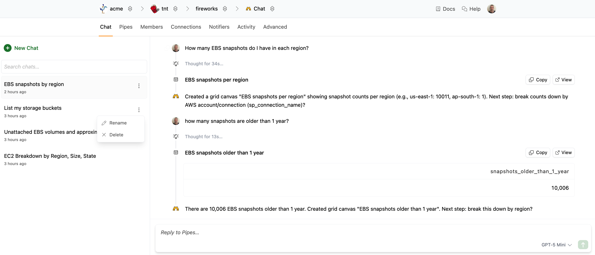
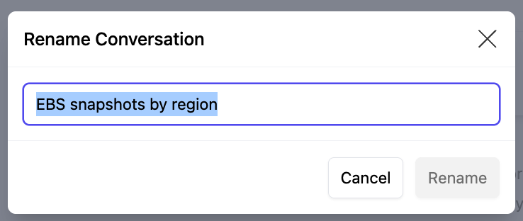
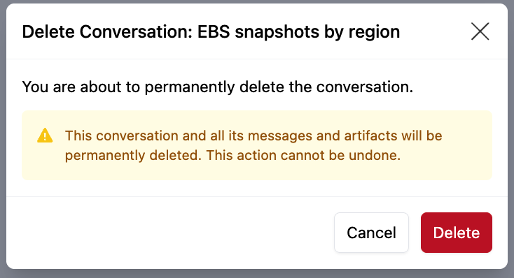

# Chat History

Your chat conversations are automatically saved and organized in the sidebar. The conversation title is automatically generated based on the chat contents. 

Click any conversation to continue where you left off.

You can delete or change the title for a conversation from the pop-up menu. Hover over the conversation you wish to modify or delete, then click the context button (3 vertical dots) to show the pop-up menu.

## Renaming a conversation

The conversation title is automatically generated based on the first prompt.  You can change the title if you want.

Hover over the conversation you wish to rename, then click the context button (3 vertical dots) to show the pop-up menu and select **Rename**.  Enter a new title and then click **Rename**.

## Deleting a conversation

Conversations are automatically saved in your history.  To delete a conversation, hover over it, then click the context button (3 vertical dots) to show the pop-up menu and select **Delete**.   You will be prompted to confirm.  Click **Delete**.

