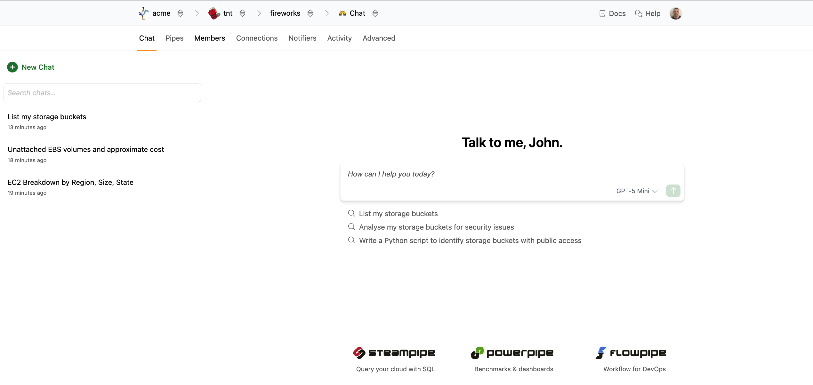

# Chat

Turbot Pipes includes an integrated AI chat assistant that helps you query, analyze, and understand your cloud infrastructure data. The AI chat feature provides intelligent assistance for running Steampipe queries, generating reports, and exploring your connected resources.

You can [ask questions](/pipes/docs/using/chat/conversation) about your infrastructure in natural language, and the AI will automatically translate them into appropriate Steampipe queries. For example:
- How many EC2 instances do I have in each region?
- List my storage buckets
- Analyze my storage buckets for security issues
- Write a Python script to identify storage buckets with public access

You can access the AI chat assistant from any workspace in Turbot Pipes. Navigate to your workspace and click on the **Chat** tab to open the interactive chat interface.

The chat interface displays your [conversation history](/pipes/docs/using/chat/history) on the left sidebar and the main chat area on the right, where you can interact with the AI assistant.
