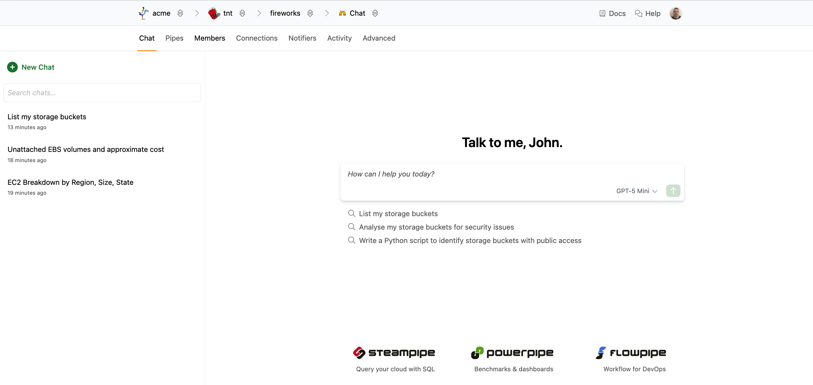

# Chat

Turbot Pipes includes an integrated AI chat assistant that helps you query, analyze, and understand your cloud infrastructure data. The [AI chat feature](/pipes/docs/using/chat) provides intelligent assistance for running Steampipe queries, generating reports, and exploring your connected resources.

You can access the AI chat assistant from any workspace in Turbot Pipes. Navigate to your workspace and click on the **Chat** tab to open the interactive chat interface.

