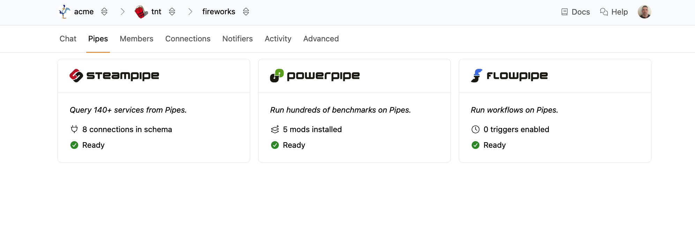

# Pipes

The Turbot Pipes platform provides hosted services for [Steampipe](/pipes/docs/using/steampipe/), [Powerpipe](/pipes/docs/using/powerpipe/), and [Flowpipe](/pipes/docs/using/flowpipe/).

To manage a service for your workspace, go to the **Pipes** tab for your workspace and click the service that you would like to manage.

